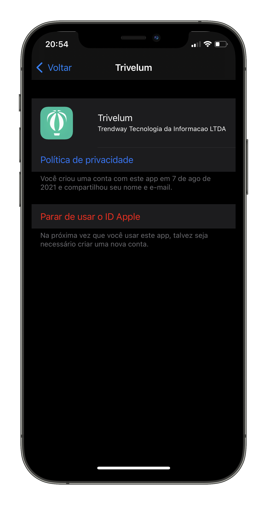

# Resetar o "Iniciar sessão com a Apple" utilizado no Trivelum

Nós do Trivelum fornecemos um método de acesso à conta utilizando sua conta da Apple mas devido a um problema na comunicação com o servidor precisamos que você realize um procedimento manual no seu celular para desvincular sua conta do nosso aplicativo e poder se cadastrar de forma correta.

## Visualizar os apps que estão usando seu ID Apple
Para ver uma lista dos apps usados com o recurso "Iniciar sessão com a Apple" e gerenciar as preferências de cada um, acesse os ajustes do ID Apple no dispositivo ou inicie sessão na página da conta do ID Apple.

### No iPhone, iPad ou iPod touch
Abra o app Ajustes e toque em seu nome.
Toque em "Senha e Segurança".
Toque em Apps Using Your Apple ID (Apps que usam seu ID Apple).

### No Mac
Selecione menu Apple e clique em "Preferências do Sistema".
Clique em ID Apple e selecione "Senha e Segurança".
Clique em Editar.

### Na Internet
Inicie sessão em [appleid.apple.com](https://appleid.apple.com/).
Acesse a seção Segurança. Em Sign in with Apple (Iniciar sessão com a Apple), selecione Manage apps & websites (Gerenciar apps e sites). 
Selecione Gerenciar.

## Parar de usar o ID Apple com um app
Nos ajustes da conta do ID Apple, você verá uma lista dos apps que estão usando o recurso "Iniciar sessão com a Apple". Para ver as informações compartilhadas originalmente com um app, selecione qualquer app da lista. Você também vê um link para a Política de Privacidade ou para os Termos e Condições do app.

Para parar de usar o ID Apple com um app, selecione Stop Using Apple ID (Parar de usar ID Apple) > Stop Using (Parar de usar).

Quando você para de usar o ID Apple com um app, a sessão é encerrada no app em seu dispositivo. Da próxima vez que você acessar o app ou o site associado a ele, poderá selecionar a opção "Iniciar sessão com a Apple" para iniciar uma sessão novamente ou criar outra conta.

Se você decidir usar o recurso "Iniciar sessão com a Apple" outra vez, a sessão será iniciada na mesma conta usada anteriormente. Alguns apps permitem criar outra senha para a conta existente para você poder iniciar sessão novamente sem usar o ID Apple.

  

